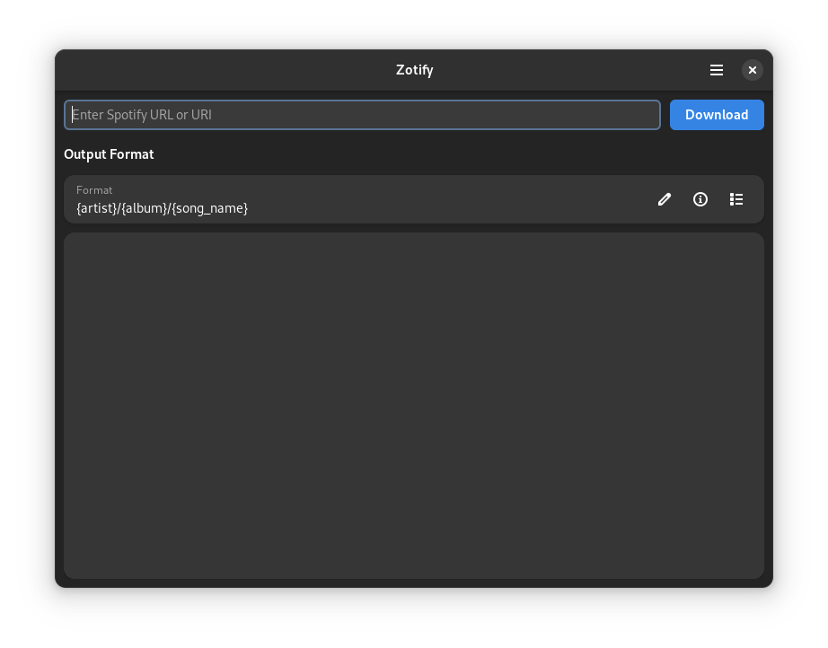
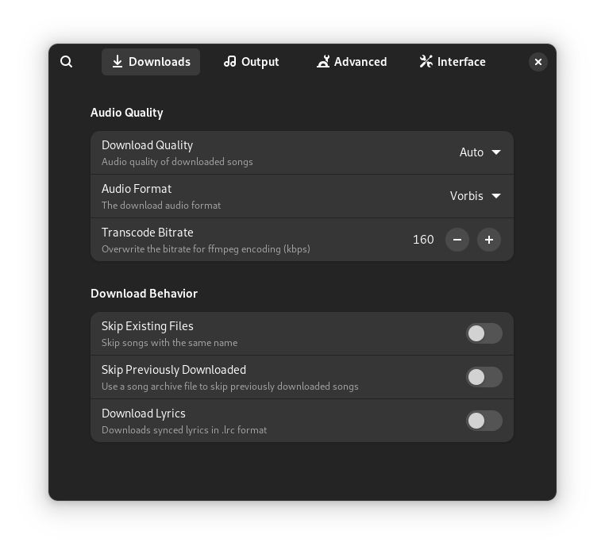

# Zotify GTK4 GUI

A graphical user interface for Zotify built using GTK4 and libadwaita, providing an easy-to-use desktop application for downloading music and podcasts from Spotify.

## Features

- Download tracks, albums, playlists, and podcasts from Spotify
- Modern, responsive GTK4 interface
- Comprehensive preferences and settings
- Flexible output formatting and organization

## Prerequisites

- Python 3.11+
- GTK4
- libadwaita
- Zotify library

## Installation

```bash
# Clone the repository
git clone https://github.com/yourusername/zotify-gtk.git
cd zotify-gtk

# Install dependencies
pip install .
```

## Usage

Launch the application:

```bash
python zotify-gtk.py
```

## Screenshots

### Main Window


### Preferences Dialog



## Contributing

Contributions are welcome! Please feel free to submit a Pull Request.


## Credits

- Zotify Contributors
- GTK and libadwaita Communities
